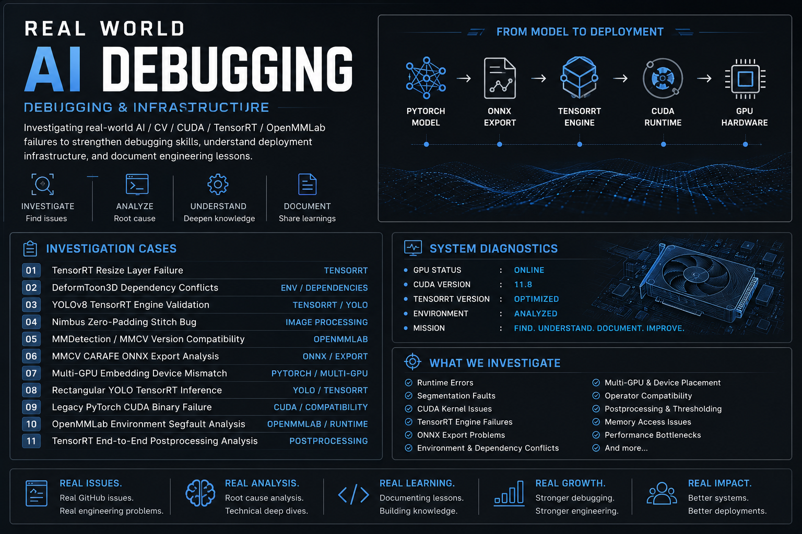

# Real-World AI Debugging

## Investigating Real AI / Computer Vision / CUDA / TensorRT / OpenMMLab Failures

This repository documents my ongoing study of real-world AI engineering issues gathered from public GitHub issues across:

- TensorRT
- CUDA
- OpenMMLab
- MMDetection
- MMCV
- ONNX
- PyTorch
- YOLO
- Transformer inference
- Multi-GPU systems
- AI deployment pipelines

The purpose of this repository is to:

- strengthen debugging skills
- understand deployment infrastructure
- analyze runtime failures
- investigate environment incompatibilities
- study TensorRT / CUDA behavior
- improve AI systems engineering knowledge
- document technical lessons learned from real production-style issues

Rather than building only toy projects, this repository focuses on:

- inference failures
- segmentation faults
- ONNX export problems
- CUDA runtime issues
- TensorRT deployment behavior
- OpenMMLab environment compatibility
- multi-GPU tensor placement
- AI infrastructure debugging

---

# Repository Structure

| Case | Topic |
|---|---|
| Case 001 | TensorRT Resize Layer Failure |
| Case 002 | DeformToon3D Dependency Conflicts |
| Case 003 | YOLOv8 TensorRT Engine Validation |
| Case 004 | Nimbus Zero-Padding Stitch Bug |
| Case 005 | MMDetection / MMCV Version Compatibility |
| Case 006 | MMCV CARAFE ONNX Export Analysis |
| Case 007 | Multi-GPU Embedding Device Mismatch |
| Case 008 | Rectangular YOLO TensorRT Inference |
| Case 009 | Legacy PyTorch CUDA Binary Failure |
| Case 010 | OpenMMLab Environment Segfault Analysis |
| Case 011 | TensorRT End-to-End Postprocessing Analysis |

---

# Technologies Investigated

## AI / CV Frameworks
- PyTorch
- TorchVision
- Ultralytics YOLO
- OpenMMLab
- MMDetection
- MMSegmentation
- MMCV
- MMDeploy

---

## Deployment & Inference
- TensorRT
- ONNX
- ONNX Runtime
- CUDA
- GPU inference pipelines
- Multi-GPU systems
- TensorRT engines

---

## Debugging & Infrastructure
- Runtime analysis
- Binary compatibility
- CUDA kernel behavior
- GPU device placement
- Native runtime crashes
- Segmentation faults
- Environment reproducibility
- Dependency/version alignment

---

# Key Engineering Concepts Studied

- CUDA runtime behavior
- GPU compute capability
- Binary compatibility
- TensorRT optimization pipelines
- Detection postprocessing
- NMS (Non-Maximum Suppression)
- Embedding layers
- Transformer tensor routing
- OpenMMLab ecosystem layering
- ONNX export limitations
- Custom CUDA operators
- Runtime memory access
- Native CUDA operations
- Deployment infrastructure engineering

---

# Why This Repository Exists

Modern AI engineering is not only about training models.

Real-world AI systems depend heavily on:

- deployment infrastructure
- runtime compatibility
- CUDA ecosystems
- inference optimization
- operator support
- environment reproducibility
- GPU memory management
- systems-level debugging

This repository exists to document that learning journey through hands-on investigation of real engineering issues.

---

# Skills Developed

- AI deployment debugging
- TensorRT troubleshooting
- CUDA environment analysis
- OpenMMLab ecosystem understanding
- ONNX export investigation
- Runtime failure isolation
- GPU inference debugging
- Multi-GPU systems reasoning
- Technical root-cause analysis
- Reproducibility-focused engineering

---

# Important Note

These investigations are educational analyses of publicly available GitHub issues.

The goal is to:
- learn from real engineering problems
- practice debugging methodology
- improve systems thinking
- better understand modern AI infrastructure
- help solve problems

---

# Author

## Dartayous
Aspiring Digital Twin / AI / Computer Vision Engineer

Focused on:
- OpenUSD
- Omniverse
- Isaac Sim
- AI deployment systems
- Computer Vision
- Simulation pipelines
- TensorRT / CUDA workflows
- AI infrastructure engineering

GitHub:
https://github.com/Dartayous