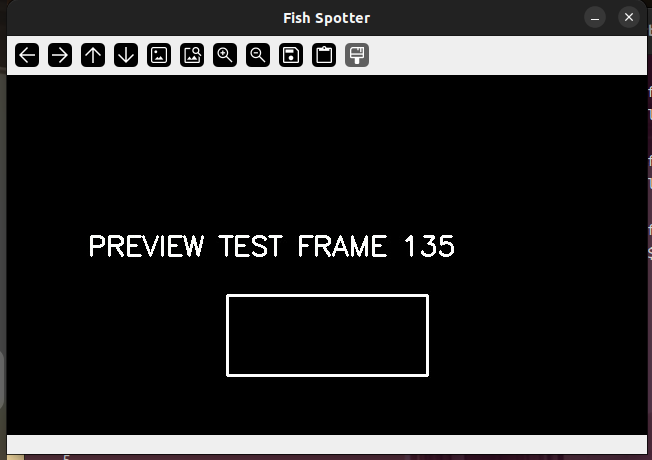

# case_014_fishdoorbell_live_preview_window

## Preview



OpenCV live preview window running with the new `--display` flag.
The preview renders annotated frames in real time and can be closed cleanly with ESC.


## 1. Original Issue

Repository:

fishDoorbell

Issue:

Add an optional live preview window that allows users to see detections in real time while tuning detector parameters.

The repository originally operated entirely in headless mode. Frames were processed and saved to disk when detections met persistence and cooldown requirements, but there was no way to visualize detections during runtime.

The maintainer requested a preview mode that would:

* Open an OpenCV display window when requested
* Show current-frame detections
* Use the same annotation style as saved images
* Remain completely optional
* Preserve headless operation by default
* Exit cleanly when the preview window is closed
* Exit cleanly when ESC is pressed
* Add test coverage without requiring a GUI environment

---

## 2. Problem Summary

The challenge was not adding object detection.

The challenge was adding a user-facing visualization feature while preserving the project's existing architecture.

Key requirements included:

* Avoid duplicating annotation logic
* Keep headless environments working
* Ensure preview shutdown was clean
* Share visualization code between saved images and live display
* Maintain all existing test coverage

The new functionality needed to integrate into the existing processing loop without changing detector behavior, persistence logic, cooldown logic, or frame saving behavior.

---

## 3. Root Cause Analysis

The repository already contained annotation logic inside `FrameWriter`.

This created a design problem.

If a preview window were added directly, there would be two separate annotation implementations:

1. Annotation code used by saved images
2. Annotation code used by the preview window

Duplicated code would eventually drift apart and become difficult to maintain.

The correct solution was to extract annotation into a reusable utility and allow both systems to consume the same implementation.

---

## 4. Investigation

I reviewed:

* `FrameWriter`
* CLI execution flow
* Detection rendering behavior
* Existing test coverage

The existing annotation pipeline:

```text
Detection Objects
        ↓
   FrameWriter
        ↓
 Annotated JPEG
```

The proposed preview feature required:

```text
Detection Objects
        ↓
 Shared Annotation Layer
      ↙       ↘
Preview     FrameWriter
Window      JPEG Output
```

This architecture would ensure visual consistency between live previews and saved images.

---

## 5. Solution Implemented

### A. Shared Annotation Utility

Created:

```text
src/fish_spotter/annotate.py
```

Added:

```python
annotate_frame(frame, detections)
```

This function:

* Draws bounding boxes
* Draws labels
* Draws confidence values
* Returns an annotated frame

This became the single source of truth for visualization.

---

### B. Refactored FrameWriter

Removed duplicated drawing logic from:

```text
src/fish_spotter/writer.py
```

Replaced it with:

```python
annotated = annotate_frame(frame, detections)
```

Benefits:

* Less code
* Easier maintenance
* Consistent rendering everywhere

---

### C. Added PreviewWindow

Created:

```text
src/fish_spotter/preview.py
```

Features:

* Opens OpenCV preview window
* Displays annotated frames
* Uses shared annotation utility
* Detects ESC key
* Detects window close events
* Provides clean shutdown handling

---

### D. Added CLI Flag

Added:

```bash
--display
```

Behavior:

```bash
fish-spotter --source video.mp4
```

Runs normally in headless mode.

```bash
fish-spotter --source video.mp4 --display
```

Opens a live preview window.

This preserved backward compatibility.

---

### E. Clean Shutdown Logic

Integrated preview handling into the main processing loop.

Added:

* ESC detection
* Window close detection
* Cleanup via `finally`
* Automatic window destruction

This prevents orphaned OpenCV windows and improves runtime stability.

---

## 6. Validation

### Unit Tests

Added:

```text
tests/test_preview.py
```

Coverage included:

* Preview remains active when visible
* ESC key exits preview mode

---

### Full Test Suite

```text
19 passed
```

Verification confirmed:

* Existing behavior unchanged
* Preview functionality working
* Shared annotation logic functioning correctly

---

## 7. Engineering Lessons Learned

### Lesson 1: Avoid Duplicate Logic

My first instinct could have been to draw boxes directly inside the preview window.

That would have created two separate annotation implementations.

Instead, extracting annotation into:

```python
annotate_frame()
```

created a reusable component that both systems can share.

This is a common software engineering pattern:

```text
Extract → Reuse → Maintain Once
```

instead of:

```text
Copy → Paste → Maintain Twice
```

---

### Lesson 2: New Features Should Preserve Existing Behavior

The issue specifically required:

```text
Headless mode remains the default.
```

The safest implementation was:

```bash
--display
```

rather than forcing display functionality on every user.

A good feature is often one that existing users never notice unless they choose to use it.

---

### Lesson 3: User Interfaces Need Shutdown Paths

Adding a window is easy.

Closing it correctly is harder.

The final implementation handles:

* ESC key
* Window close button
* Normal application shutdown
* Cleanup through `finally`

A feature is not complete until it handles failure and exit conditions.

---

### Lesson 4: Refactoring Is Often Part of Feature Development

This issue appeared to be a UI enhancement.

In reality, the best solution required improving architecture first.

The most important code added was not the preview window itself.

The most important improvement was extracting shared annotation behavior into its own reusable module.

---

## Outcome

Implemented an optional OpenCV live preview system that:

* Preserves headless operation
* Shares annotation logic across the application
* Supports clean shutdown behavior
* Adds dedicated test coverage
* Passes the full test suite

This contribution demonstrates practical experience with:

* OpenCV visualization
* Runtime UI controls
* Application shutdown handling
* Code refactoring
* Shared utility design
* Test-driven validation
* Open-source feature implementation
